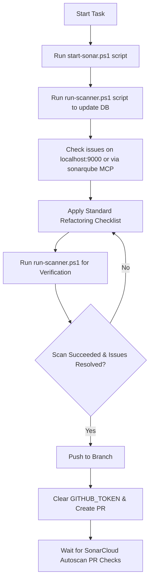

# SonarQube & SonarCloud Unified Workflow Skill

This skill provides a structured workflow for AI agents to analyze, refactor, and verify code quality using SonarQube (Local Docker Server) and SonarCloud (Cloud / GitHub PR integration).

## Quick start

Execute the PowerShell helper scripts bundled with this skill to start containers and run scans:

```powershell
# 1. Start Postgres and SonarQube containers
.agents/skills/sonarqube-workflow/scripts/start-sonar.ps1

# 2. Run scanner (auto-detects project key, prompts for token)
.agents/skills/sonarqube-workflow/scripts/run-scanner.ps1 -Token "YOUR_TOKEN"
```

## Workflows

### Execution Workflow



### Clean-Code Action Checklist

* [ ] **Verify Prerequisites**: Start database and local SonarQube using `start-sonar.ps1`.
* [ ] **Partition Tests**: Check [REFERENCE.md](REFERENCE.md) to ensure `sonar.exclusions` and `sonar.test.inclusions` are configured to prevent false positives.
* [ ] **Run Initial Scan**: Perform a local scan using `run-scanner.ps1` to update localhost DB.
* [ ] **Locate Issues**: Access issues on `http://localhost:9000` or use `sonarqube` MCP tools.
* [ ] **Refactor Violations**: Refactor code matching the standard rules (see [REFERENCE.md](REFERENCE.md) for a list of common Sonar violations).
* [ ] **Verify Fixes**: Re-run scan using `run-scanner.ps1` to confirm issues are resolved.
* [ ] **Safe PR Flow**: Before creating or merging pull requests, clear env variables: `$env:GITHUB_TOKEN=$null` (see [REFERENCE.md](REFERENCE.md) for details).

## Advanced features

For detailed properties, configurations, and reference tables, see:
* [REFERENCE.md](REFERENCE.md)
* Script: [start-sonar.ps1](scripts/start-sonar.ps1)
* Script: [run-scanner.ps1](scripts/run-scanner.ps1)
