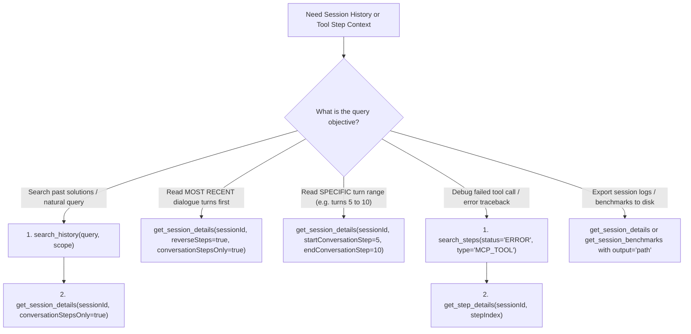

# chronicle-mcp

Developer agents operating across multiple sessions and workspaces often struggle to reuse past execution history due to three limitations in raw log analysis:

1. **Context Bloat**: Reading raw JSONL transcripts dumps system metadata, duplicate tool outputs, and execution schemas into the prompt, causing context truncation.
2. **High Noise Ratio**: Actual developer-agent dialogue is buried within raw JSON logs, requiring parsing to extract clean context.
3. **No Cross-Session Search**: Finding past solutions or specific execution errors (such as failed tool calls) across multiple workspaces is impossible without reading log files sequentially.

This local Model Context Protocol (MCP) server indexes, synchronizes, and exposes agent conversation logs, tool execution steps, subagent hierarchies, and execution benchmarks from **Antigravity** and **Cursor** workspaces. It provides vector search capabilities, BPE token analysis, and prompt caching simulations over transactional SQLite storage.

## Features

- **Incremental History Synchronization**: Scans and parses local logs (`transcript.jsonl` and Composer states) from your active agent workspace. Skips previously indexed sessions to complete subsequent syncs in less than a second using SQLite `ON CONFLICT DO UPDATE` constraints.
- **Background Auto-Sync**: Optional background synchronization (`CHRONICLE_AUTO_SYNC=true` or `--auto-sync` flag) runs automatically before executing any query tools, utilizing coalesced locking (to avoid SQLite write locks) and a 5-second cooldown.
- **Workspace-level Isolation & Resolution**: Supports automatic workspace project path inference (analyzing logs/tool working directories) and a dynamic `scope: "workspace"` parameter. This resolves queries to the current active project workspace automatically without requiring manual configuration.
- **Hierarchical Vector Search**: Two-stage search that ranks matching sessions by summary vector, then ranks individual chunks within those top sessions to return contextually relevant history.
- **Subagent Linking and Discoverability**: Automatically extracts subagent conversation IDs from steps of type `INVOKE_SUBAGENT`. Links child sessions to their parent sessions dynamically, allowing bidirectional traversal of agent hierarchies.
- **Deep Tool & Step Inspection**: Indexes all `USER_INPUT`, `PLANNER_RESPONSE`, and `MCP_TOOL` steps (including thinking blocks, arguments, and return values). Retrieve specific step details, slice steps by range, filter steps by `toolName`/`serverName`, or search for errors and failed tool calls.
- **Field Payload Exclusion**: Supports `excludeContent` across details and step searches to strip large `content` and `thinking` payloads, preventing context window and token bloat.
- **Tool Execution Analytics**: Aggregates execution frequency counts across recent sessions using `get_tool_usage_stats` to diagnose latency bottlenecks.
- **Performance Benchmarking & Caching Simulation**: Computes steps, tool calls, duration, errors, and standard BPE token counts (via `js-tiktoken`). Simulates turn-by-turn prefix prompt caching to calculate cumulative input tokens, peak context sizes, cache hit rates, and estimated cost savings. *Note: Caching calculations assume a continuous hot cache, without simulating TTL expiration or provider-specific minimum token limits.*
- **Zero Native Dependencies**: Built on pure `node:sqlite` using SQLite WAL mode for fast queries without native MSBuild/Python build requirements on Windows.

## Support Matrix

| Feature | Antigravity Adapter | Cursor Adapter |
| :--- | :--- | :--- |
| **Log Source** | File-based JSON Lines (`transcript.jsonl`, `transcript_full.jsonl`) | SQLite database (`state.vscdb`) |
| **Workspace Paths** | Resolved from step-level execution directories | Extracted from `workspacePath` in Composer state |
| **Granular Steps** | Complete step history (`USER_INPUT`, `PLANNER_RESPONSE`, `MCP_TOOL`, etc.) | Conversation history turns (`user` prompts and `ai`/`assistant` replies) |
| **Performance Benchmarking** | Detailed step-level duration, error tracking, and caching simulation | Limited (estimates derived from plain text/tokens and session creation time) |
| **Subagent Linking** | Bidirectional traversal of parent/child relationships | Not supported (no subagent hierarchy concept in Cursor Composer) |

## Tech Stack

- **Core**: Node.js & TypeScript
- **Database**: `node:sqlite` (SQLite WAL mode)
- **Embeddings**: `@huggingface/transformers` (local ONNX pipeline running on CPU)
- **SDK**: `@modelcontextprotocol/sdk`

## Project Structure

```text
chronicle-mcp/
├── src/
│   ├── __tests__/           # Test suite (HistoryStore, SessionParser, EmbeddingClient, etc.)
│   ├── adapters/            # Log & state format parsers
│   │   ├── Antigravity.ts   # Antigravity log adapter
│   │   ├── Cursor.ts        # Cursor Composer state adapter
│   │   ├── SessionParser.ts # Pure in-process log parser
│   │   └── types.ts         # Data models and interfaces
│   ├── db.ts                # HistoryStore adapters (SQLite & In-Memory)
│   ├── embeddings.ts        # EmbeddingClient adapters (transformers & mock)
│   ├── index.ts             # MCP server entry point and tool schema handlers
│   └── search.ts            # Search controllers and details retrieval
├── package.json
└── tsconfig.json
```

## Install

Clone, build, and install dependencies:

```bash
git clone https://github.com/loerei/chronicle-mcp.git
cd chronicle-mcp
npm install
npm run build
```

## Client Configuration

Add the server to your MCP client configuration (e.g. Claude Desktop at `%APPDATA%\Claude\claude_desktop_config.json`).

### Option 1: Using Command-Line Arguments (recommended)
Add the `--auto-sync` flag to automate database synchronization before every tool execution. This ensures search queries and session listings always return the most up-to-date data without requiring manual calls to `sync_history`. When active, the manual `sync_history` tool is automatically hidden from the client to simplify the tool schema.

```json
{
  "mcpServers": {
    "chronicle-mcp": {
      "command": "node",
      "args": [
        "D:/Projects/chronicle-mcp/dist/index.js",
        "--auto-sync"
      ]
    }
  }
}
```

### Option 2: Using Environment Variables
Alternatively, you can enable auto-syncing by setting the `CHRONICLE_AUTO_SYNC` environment variable to `"true"`:

```json
{
  "mcpServers": {
    "chronicle-mcp": {
      "command": "node",
      "args": ["D:/Projects/chronicle-mcp/dist/index.js"],
      "env": {
        "CHRONICLE_AUTO_SYNC": "true"
      }
    }
  }
}
```

## Tools

### Tool Selection Router



- **`chronicle_guide`**: Self-guide tool providing usage patterns, tool selection matrix, and token-saving rules.
- **`sync_history`**: Triggers incremental synchronization of local history logs (hidden when auto-sync is active).
- **`list_sessions`**: Lists synced sessions with optional filter parameters (`adapter`, `projectPath`, `scope`, `limit`). Supports automatically resolving the current project workspace when `scope: "workspace"`.
- **`get_session_details`**: Retrieves formatted Markdown of a session's conversation history. Supports range slicing (`startStep`/`endStep`), optional detailed blocks (`includeToolCalls`, `includeCallResults`), and `excludeContent` to omit large payloads to prevent token bloat.
- **`get_step_details`**: Retrieves the raw JSON structure of a specific step (including thinking, tool calls, and results).
- **`get_session_benchmarks`**: Calculates and compares execution metrics (steps, tool calls, duration, cumulative input tokens, output tokens, errors, peak context size, simulated cache hit rate, and cost savings assuming cache reads are billed at a 10% rate under hot cache assumptions) across one or more sessions, with optional grouping.
- **`search_history`**: Performs semantic search against synced session summaries and chunks. Supports filtering by `projectPath` and `scope` (`workspace` | `all`).
- **`search_steps`**: Searches logged steps with filters for `sessionId`, step `type` (e.g., `PLANNER_RESPONSE`, `MCP_TOOL`, `COMMAND`), step `status` (e.g., `ERROR`, `DONE`), `projectPath`, `scope` (`workspace` | `all`), `toolName`, `serverName`, `excludeContent`, and an optional text keyword `query`. Used to retrieve failed tool calls, specific command executions, or search within specific tool contexts.
- **`get_tool_usage_stats`**: Retrieves tool execution statistics (counts) across recent sessions (default 30). Supports filtering by `projectPath` and `scope` (`workspace` | `all`).

## License

MIT
