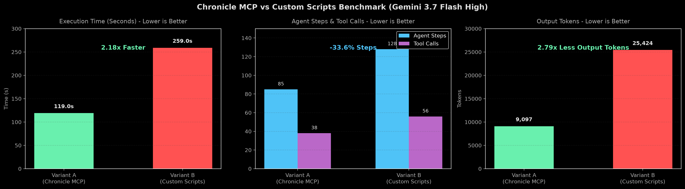

# PRD and Tickets Resolution Benchmark

This document tracks how an AI coding agent (Gemini 3.7 Flash High) handles digging through hundreds of conversation sessions to audit historical PRDs and their decomposed tickets.

We compared two approaches on the exact same task:
1. **Variant A (Chronicle MCP)**: Using Chronicle MCP tools (topic-aware guide, turn slicing, and compact markdown history search).
2. **Variant B (Custom Scripts)**: No MCP tools. The agent has to write its own Python scripts to crawl brain directories and parse Antigravity `transcript.jsonl` logs on disk.

---

## The Task

* **Prompt**: Find every PRD created by `/to-prd` and all tickets decomposed by `/to-tickets` across all past sessions. For each PRD and ticket, report whether it is resolved, in progress, or unresolved.
* **Scope**: 500+ local conversation brain folders and raw JSONLines log files across multiple repositories (`chronicle-mcp`, `YumeShelf`).
* **Session Transcripts**: [Variant A Log](logs/variant-a-chronicle-mcp.md) | [Variant B Log](logs/variant-b-custom-scripts.md)

---

## Comparison Table

| Metric | Chronicle MCP (A) | Custom Scripts (B) | Delta (A vs B) |
| :--- | :---: | :---: | :---: |
| **Task Accuracy** | 100% (5/5 PRDs, 34/34 Tickets) | 100% (5/5 PRDs, 34/34 Tickets) | Same |
| **Agent Steps** | 85 | 128 | **-33.6%** |
| **Tool Calls** | 38 | 56 | **-32.1%** |
| **Execution Time** | 119.0s (1.98 min) | 259.0s (4.31 min) | **-54.1% (2.18x faster)** |
| **Output Tokens** | 9,097 | 25,424 | **-64.2% (2.79x fewer tokens)** |
| **Cumulative Input Tokens** | 3,392,996 | 3,388,776 | +0.1% |
| **Peak Context Window** | 82,503 | 62,246 | +32.5% |
| **Prompt Cache Hit %** | 97.7% | 98.8% | -1.1% |
| **Cost Savings %** | 87.9% | 88.9% | -1.0% |

---

## What Actually Happened

Both agents found the exact same ground truth: 5 PRDs (3 resolved, 2 on hold or open) and 34 tickets across both repositories.

The difference is how they got there.

### 1. Writing Custom Scripts Wastes a Lot of Tokens and Time
In Variant B, the agent spent most of its time writing throwaway Python scripts to scan hundreds of brain directories, parsing megabytes of raw Antigravity `transcript.jsonl` files line by line, and debugging regex search filters. That burned 25,424 output tokens just generating script boilerplate. It took 4.3 minutes to finish.

### 2. Chronicle MCP Just Returns Clean Answers
In Variant A, the agent asked `chronicle_guide` for the search recipe, ran two targeted queries with `search_history`, and inspected the matching turns with `query_transcript`. It finished in under 2 minutes (119 seconds) with zero custom code written.
